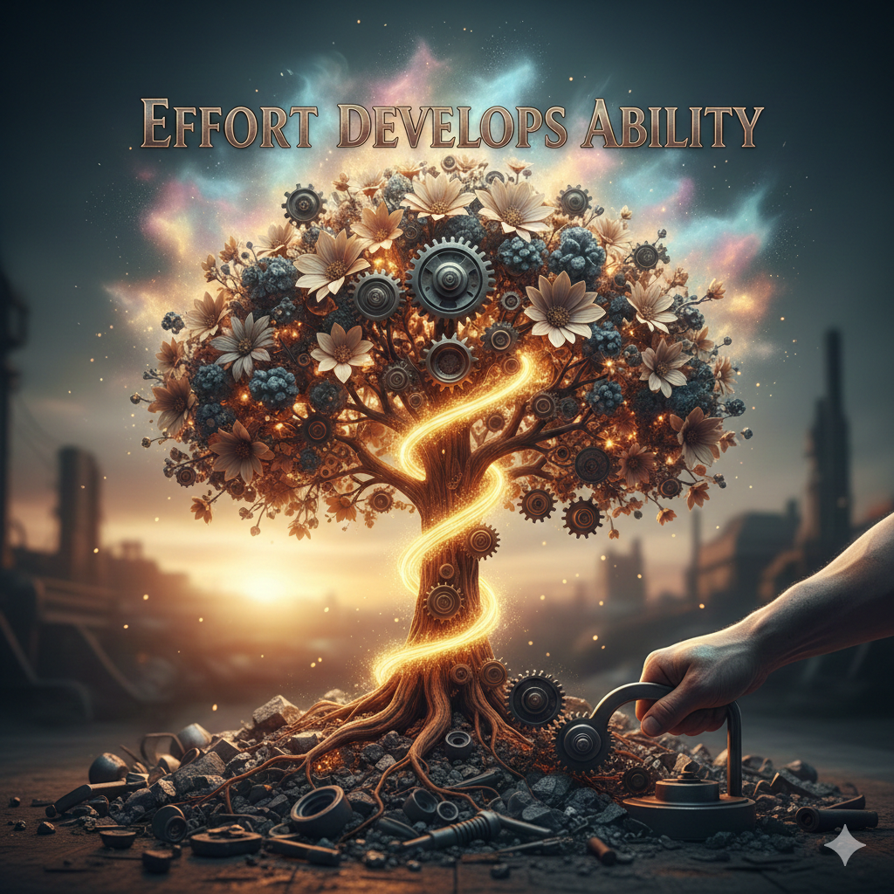

# Welcome to My Reading Notes

Hi, I’m Alex. This website contains my reading notes.

- [Read: 01 - Learning Markdown](class1_notes/class1.md)
- [Read: 02 - The Coder's Computer](class2_notes/class2.md)
- [Read: 03 - Revisions and the Cloud](class3_notes/class3.md)
- [Read: 04 - Structure web pages with HTML](class4_notes/class4.md)
- [Read: 05 - Design web pages with CSS](class5_notes/class5.md)



### *Effort develops ability.*

>* Embrace Challenges
>* Value Effort Over Innate Talent
>* Seek and Learn from Feedback

```js
    const alexProfile = { 
      name: "Alex",
      wishes: "Have a beautiful day!", 
      hobbies: ["reading", "spending quality time", "learning new things"],
      contact: "test@test.test"
    };

    alexProfile.greeting = `Hi Friends! You can call me ${alexProfile.name}.`;

    const htmlOutput = `
      <p>--- ${alexProfile.name}'s Introduction ---</p>
      
      <strong>${alexProfile.greeting}</strong><br>

      I love:<br>
      <ul>
        <li>${alexProfile.hobbies.join('</li><li>')}</li>
      </ul>

      Feel free to contact me at: <strong>${alexProfile.contact}</strong><br>

      <br>
      <em>${alexProfile.wishes}</em><br>
    `;
    
    document.getElementById('profile-output').innerHTML = htmlOutput;
```
